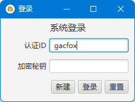
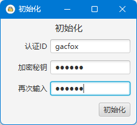
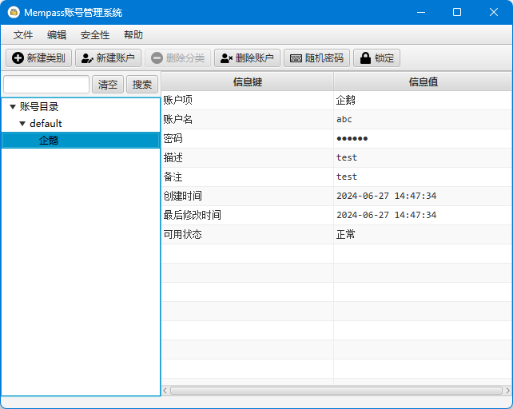
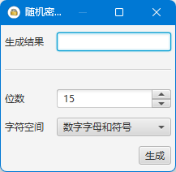

# Mempass

Mempass is a desktop password management tool developed with Java17 and JavaFX. It uses H2 embedded database and a symmetric key algorithm to encrypt and store data. Local data is stored in `~/appdata/roaming/mempass` on Windows, and in `~/.mempass` on Unix/Linux. These datas can be synced with OneDrive or other similar tools for backup and accessibility.

## Features

* Encrypted local storage
* Organize account data with categories and tables
* Random password generator

## Build

To build the application, use the following command:

```bash
gradle jpackageImage
```

This command will create an executable application with an embedded Java environment using `jpackage`. There is no need to install Java on the target host.


## Instructions

### Login

This application requires an authId and a master password to log in. The authId represents a database instance, and the master password is used as the HMAC encryption key to encrypt the database.



### Create new database

If there is no database instance for the authId, you must create a new database first.



After the database is created, the user can login with the authId and the master password.

### Managing Categories and Accounts

Click `New Category` to create a new category and `New Account` to create a new account. Categories and accounts will be displayed in the left tree view, and account details will be shown in the right table view.



### Generating a Random Password

Click `Random Password` to generate a random password with given rules.


